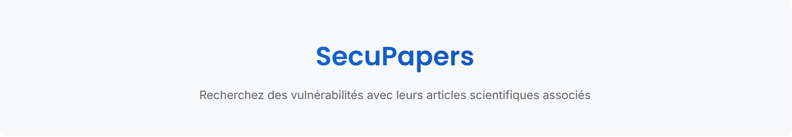

Le projet a été réalisé dans le cadre de l'enseignement de spécialité Python. L'objectif était de développer un moteur de recherche capable de fournir une liste de documents pertinents en fonction d'une requête saisie par l'utilisateur. Notre projet consiste à développer un outil permettant à l'utilisateur de rechercher une vulnérabilité connue, appelée CVE. Le moteur de recherche fournit lui-même les articles scientifiques associés à la vulnérabilité.

---

## Table des matières

1. [Fonctionnalités](#fonctionnalités)
2. [Installation](#installation)
3. [Utilisation](#utilisation)
4. [Considérations](#considérations)
5. [Documentation](#documentation)
---

## Fonctionnalités

- Recherche de CVE (Common Vulnerabilities and Exposures)
- Recherche d'articles scientifiques associés
- Utilisation des calculs TF-IDF (Term Frequency-Inverse Document Frequency) pour fournir des résultats pertinents

---

## Installation

Suivez les intstructions suivantes affin d'installer l'application sur votre machine.

```bash
# Clonez le repo
$ git clone https://github.com/EliasBaroudi/search-engine-python

# Accédez au dossier du projet
$ cd search-engine-python

# Installez les dépendances (conseillé de le faire dans un environnement créé au préalable)
$ pip install -r requirements.txt
```

## Utilisation

- Lancement de l'application :

```bash
# Exemple d'exécution du projet
$ cd src/
$ python3 interface.py
```

Une fois l'application lancée, le terminal affichera une adresse locale, sur laquelle est hebergée l'application.


- Utilisation de l'interface :

** Zone de recherche **  
Voici un aperçu de la zone de recherche. L'utilisateur peut spécifier le nombre de documents à retourner, saisir des mots-clés, puis lancer la recherche en cliquant sur le bouton "Rechercher".
L'utilisateur peut également filtrer les résultats :
- Choisir les sources qui l'intéressent (NST, Kevin)
- Choisir uniquement les documents pour lesquels un article scientifique a été trouvé


** Consulter les resultats **  
Voici un aperçu de l'interface après l'exécution d'une recherche. Elle affiche les différentes CVE jugées pertinentes en fonction des critères de recherche, avec les informations suivantes : le score de pertinence, le nom de la CVE, son ID, des liens vers des informations détaillées sur la CVE, ainsi que les articles scientifiques associés à la vulnérabilité.


## Considérations :

Le script utilise des données préenregistrées (fichiers data.pkl pour les CVE et corpus.pkl pour le corpus, constitué des CVE ainsi que des articles issus d'Arxiv). Cette méthode d'extraction permet de charger l'application plus rapidement. En cas de suppression de ces fichiers, le script sauvegarde automatiquement les variables utilisées à la fin du chargement.
Si vous souhaitez modifier ces données, il est conseillé de mettre à jour la requête envoyée à l'API Kevin dans le fichier main.py.

## Documentation :

gitHub Pages (Doxygen) : https://eliasbaroudi.github.io/search-engine-python/html/index.html 
